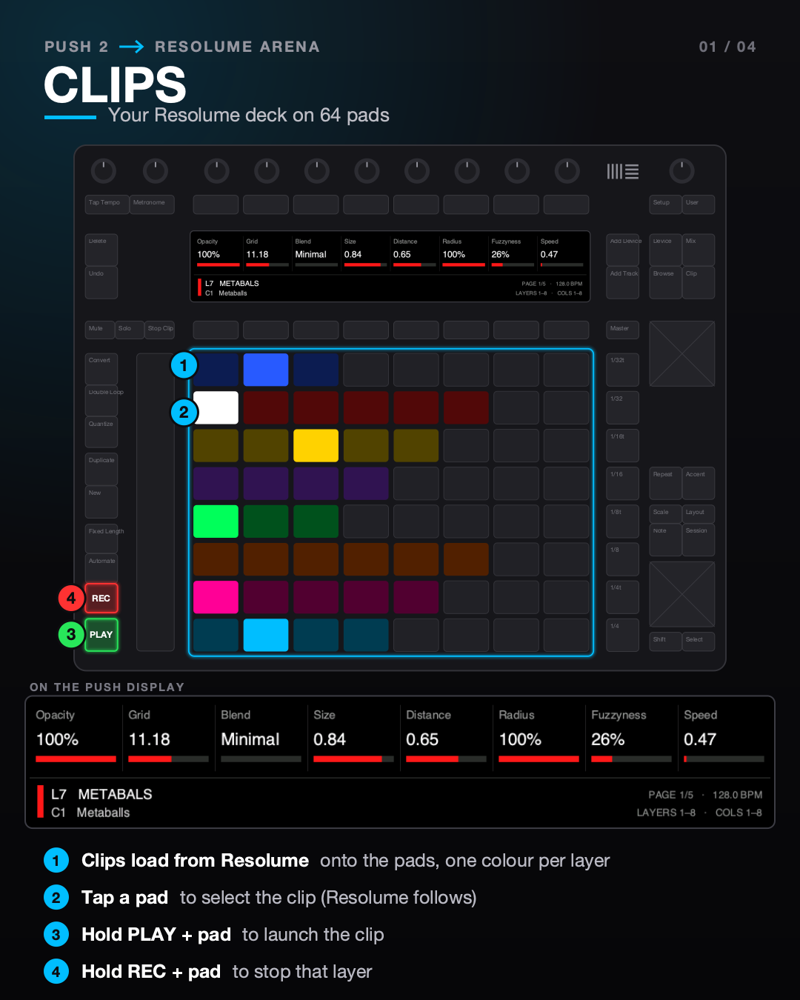
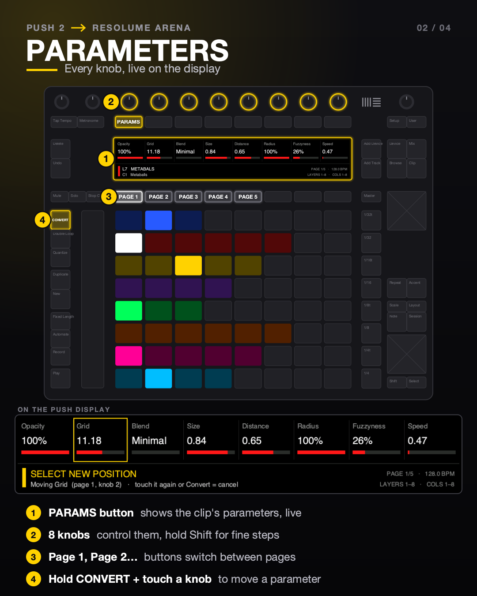
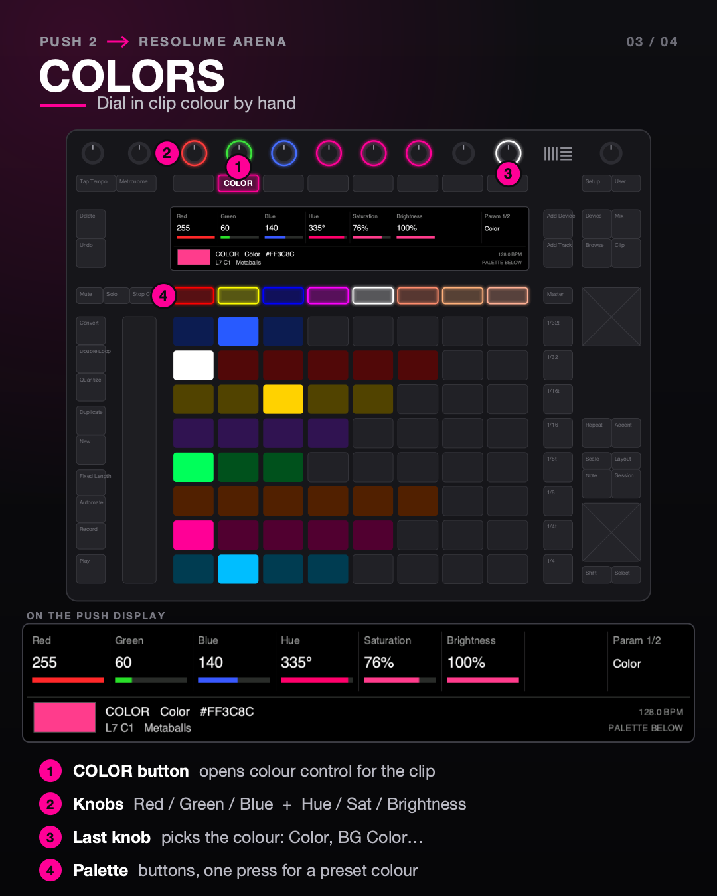
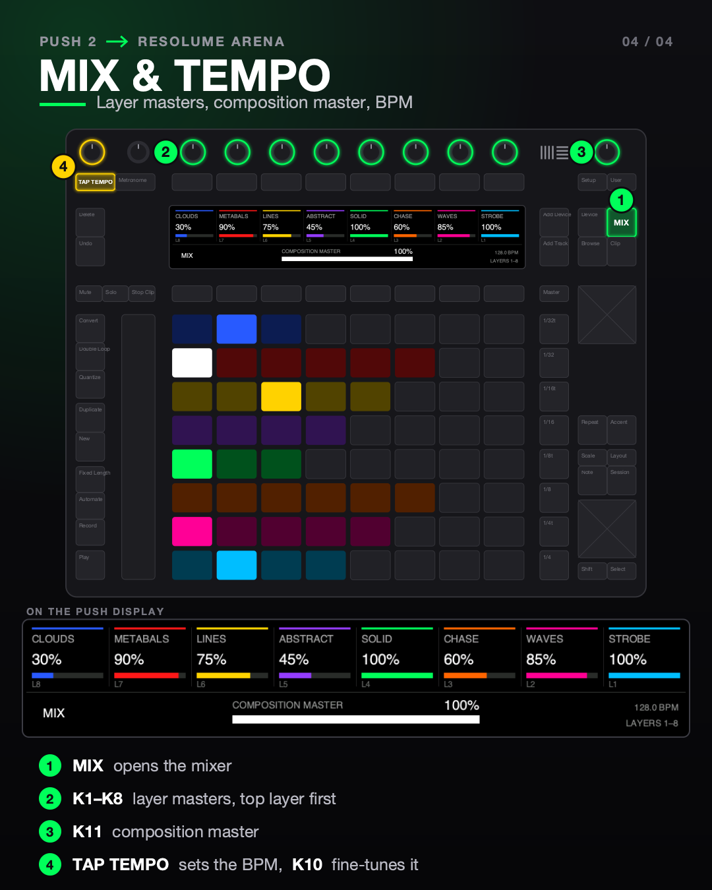
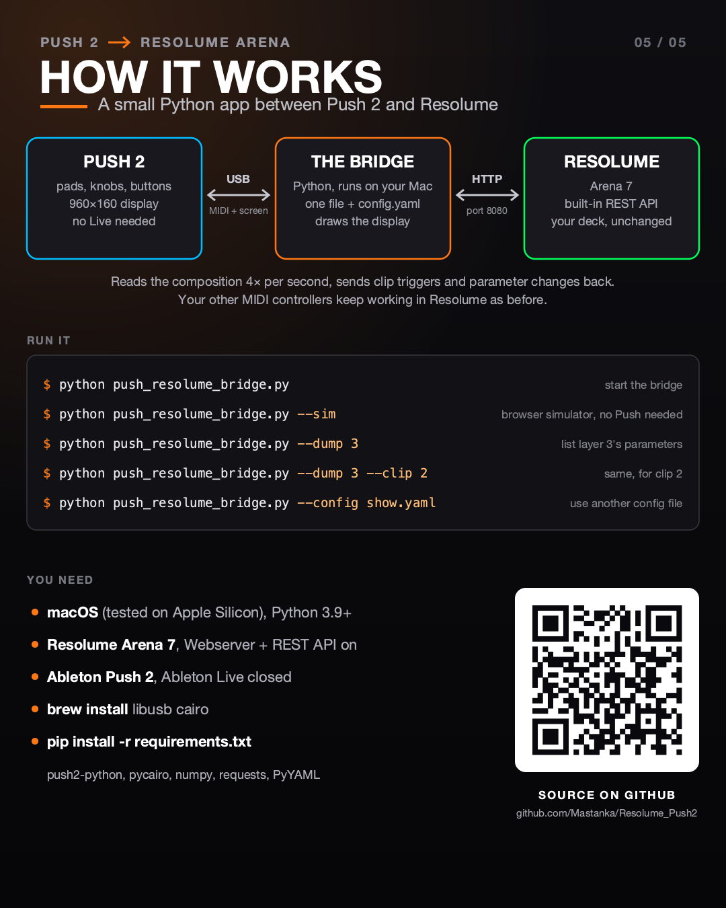

# Push 2 → Resolume Arena

Use an **Ableton Push 2** as a hands-on controller for **Resolume Arena**.
Launch clips from the pads, change clip and effect parameters with the knobs, dial in colours, mix
layers and tap the tempo, all with a custom interface on the Push's own display.

It was built for live concert lighting (Resolume pixel-mapping LED bars behind a band), but
it works with any Resolume deck.

<p>
  
  
  
  
</p>

## What it does

- **Clips:** your Resolume deck appears on the 8×8 pads, one colour per layer (dim = loaded,
  bright = playing, pulsing on the beat). Tap a pad to select a clip, hold **Play** + pad to launch it,
  hold **Record** + pad to stop the layer, hold **Play** + a button below the display to launch a whole column.
- **Live controls:** **Stop Clip** is a blackout button, the buttons right of the pads **flash** their
  layer to full while held, **Mute** / **Solo** + pad mute or solo a layer.
- **Parameters:** the selected clip's parameters (generator, effects, transport) show on the display
  with live values. Turn them with the 8 knobs, flip pages with the buttons below the display, and
  move the parameters you use most onto page 1.
- **Colors:** red / green / blue and hue / saturation / brightness knobs for the clip's colours, your own
  palette on the buttons below the display, a **master colour** for the whole show, and paste a colour
  to many clips at once.
- **FX:** switch the clip's, layer's and composition's effects on and off, with their amount on the knobs.
- **Mix:** one knob per layer master, plus the composition master; mute and solo per layer.
- **Tempo:** Tap Tempo (Resolume's own tap), resync, a BPM knob, and a beat indicator.

It talks to Resolume through Resolume's own REST API and WebSocket (live updates), so there is nothing to install in Resolume and
your deck stays unchanged. Other MIDI controllers mapped in Resolume keep working alongside it.



## Quick start

For people who already have Homebrew and Python:

```bash
brew install libusb cairo pkg-config git
git clone https://github.com/Mastanka/Resolume_Push2.git && cd Resolume_Push2
python3 -m venv .venv && source .venv/bin/activate
pip install -r requirements.txt
python push_resolume_bridge.py
```

Before you run it: in Resolume, **Preferences → Webserver → Enable Webserver & REST API**
(port 8080).

## Detailed installation (macOS)

Tested on macOS (Apple Silicon) with Resolume Arena 7.23. Windows and Linux may work, but
haven't been tried.

**1. Turn on Resolume's web API**
Resolume Arena → **Preferences → Webserver** → tick **Enable Webserver & REST API**. Leave the
port at **8080**.

**2. Install Homebrew** (skip if `brew --version` already works). Open **Terminal** and paste
the install command from [brew.sh](https://brew.sh).

**3. Install the system libraries**
```bash
brew install libusb cairo pkg-config git
```
`libusb` lets the bridge draw on the Push display, and `cairo` draws the interface.

**4. Download this project**
```bash
cd ~/Documents
git clone https://github.com/Mastanka/Resolume_Push2.git
cd Resolume_Push2
```
(Or use **Code → Download ZIP** on GitHub, unzip it, and `cd` into the folder.)

**5. Create a Python environment and install the packages**
```bash
python3 -m venv .venv
source .venv/bin/activate
pip install -r requirements.txt
```
Python 3.9 or newer is fine; macOS's built-in `python3` works. This installs push2-python,
pycairo, numpy, requests and PyYAML into the project folder only.

**6. Connect the Push**
Plug in the Push 2 with its power supply (the display needs it), and make sure **Ableton Live is
closed**, because Live takes over the Push.

**7. Run it**
```bash
source .venv/bin/activate      # each time you open a new Terminal window
python push_resolume_bridge.py
```
The Push display shows your deck. Press **Ctrl+C** to quit.

### Troubleshooting

| Problem | Fix |
|---|---|
| Display says *Waiting for Resolume* | Check step 1, and that Resolume is running on the same Mac (or set `host` in `config.yaml`). |
| *Push 2 MIDI port not found* | The Push is off or unplugged, or Ableton Live is still running. |
| Pads work, display stays black | The Push isn't on its power supply, or libusb is missing (`brew install libusb`). |
| `pip install` fails on pycairo | `brew install cairo pkg-config`, then run `pip install` again. |

## Controls

**Clips and live**

| Control | Does |
|---|---|
| **Pads** | Select a clip (it opens in Resolume's clip panel too) |
| **Play** + pad | Launch the clip |
| **Play** + button below the display | Launch the whole column above that button |
| **Record** + pad | Stop that layer |
| **Mute** / **Solo** + pad | Mute / solo that pad's layer (muted layers turn grey) |
| **Buttons right of the pads** | Flash: hold = that row's layer at 100 %, release = back |
| **Stop Clip** | Blackout: composition master to 0, press again to restore (blinks red, banner on the display) |
| ▲ ▼ ◀ ▶ | Scroll layers / columns (Shift = jump 8) |

**Menus** (buttons above the display, and Mix / Master)

| Menu | 8 knobs | Buttons below the display |
|---|---|---|
| **PARAMS** (1st button) | The clip's parameters. **Convert** + touch a knob = move a parameter: change page, touch the target knob, the two swap | Page 1–8 |
| **COLOR** (2nd button) | Red, Green, Blue, Hue, Saturation, Brightness; last knob = which colour | Your palette. **Shift** + button = save the current colour there. Hold **Duplicate** + pad / button right of a row / button below = paste the colour to that clip / layer / column |
| **FX** (3rd button) | Effect amount | Effect on / off (Page < > for more effects) |
| **MIX** (Mix button) | Layer masters, top layer first | Mute; hold **Solo** = solo |
| **Master** button | COLOR for the whole show (the composition's Colorize effect); 7th knob = amount, 8th = on / off | Your palette |

**Knobs and tempo**

| Control | Does |
|---|---|
| **Shift** + knob | Fine steps |
| **Master knob** (far right) | Selected layer's opacity, or the composition master in MIX |
| **Tap Tempo** | Resolume's tap tempo. **Shift** + Tap Tempo = resync (beat 1 = now). Flashes on the beat |
| **Tempo knob** (far left) | BPM ±1, Shift ±0.1 |
| **Metronome** | Pads pulse on the beat on / off |

## Configuration

Everything is in [`config.yaml`](config.yaml): Resolume address, knob step sizes, and optionally
your own list of parameters per layer. To see which parameters a layer has:

```bash
python push_resolume_bridge.py --dump 3            # layer 3
python push_resolume_bridge.py --dump 3 --clip 2   # layer 3, clip 2
```

The parameter order you set with **Convert** is saved in `pins.yaml`, your own colours in
`colors.yaml`. Delete either file to go back to the defaults.

| Command line | |
|---|---|
| `python push_resolume_bridge.py` | Run the bridge |
| `--sim` | Browser simulator of the Push at http://localhost:6128, no hardware needed |
| `--dump LAYER [--clip COLUMN]` | List parameter paths for `config.yaml` |
| `--config FILE` | Use a different config file |
| `--check LAYER` | Test every Resolume command on a spare layer (each change is undone) and print OK / FAIL. Add `--check-columns` to also launch a column |

## Ideas and feedback welcome

Got an idea for a new feature, a workflow that would help your show, or found something that
doesn't work with your Resolume setup? **[Open an issue](https://github.com/Mastanka/Resolume_Push2/issues/new/choose)** and tell me about it.
Every suggestion is read. Some things already on the list:

- Clip thumbnails on the display and Resolume's clip colours on the pads
- Touch strip for the crossfader
- Pad pressure for intensity
- Deck switching

## License

[MIT](LICENSE). Free to use, change and share.
