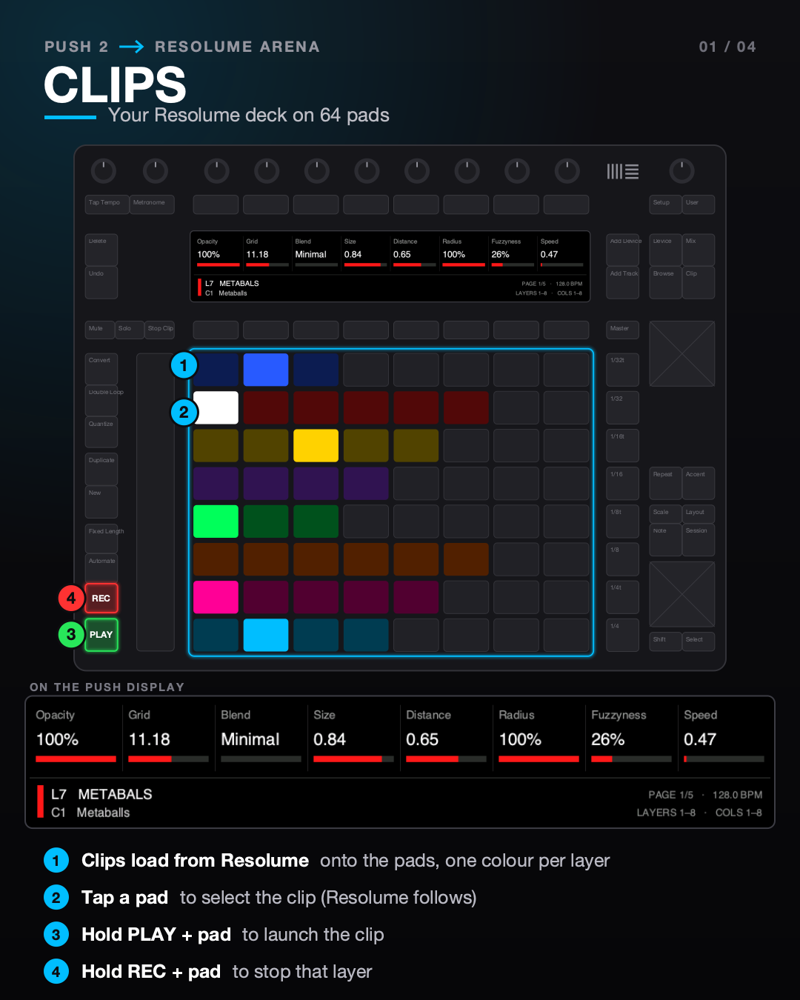
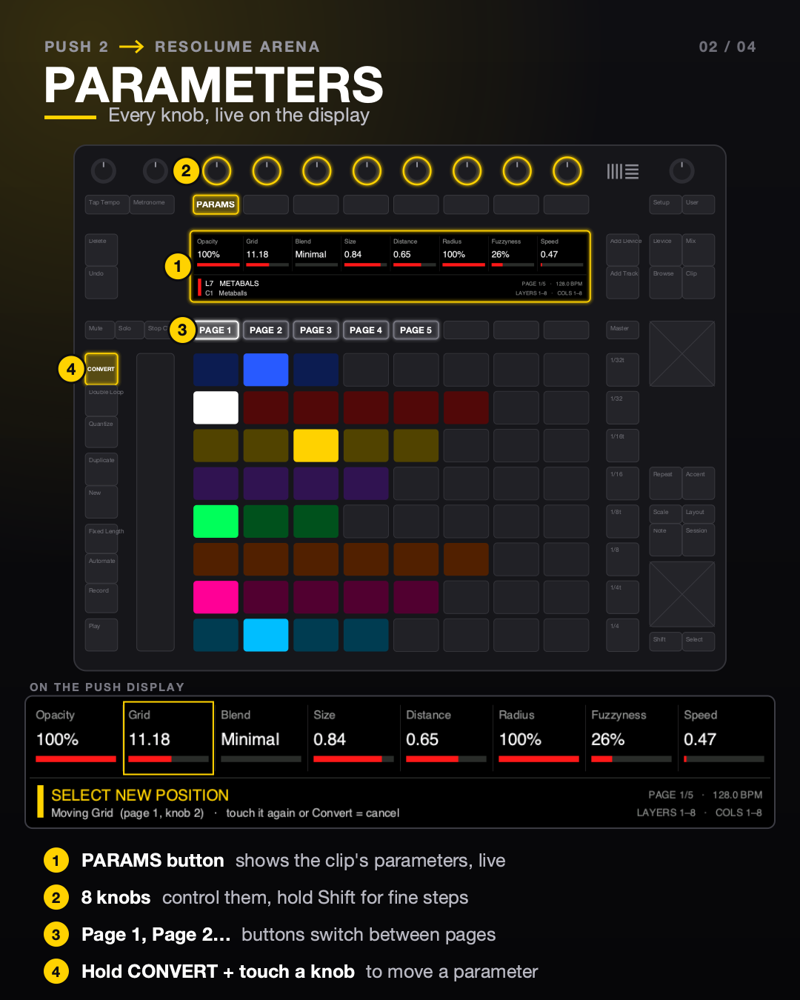
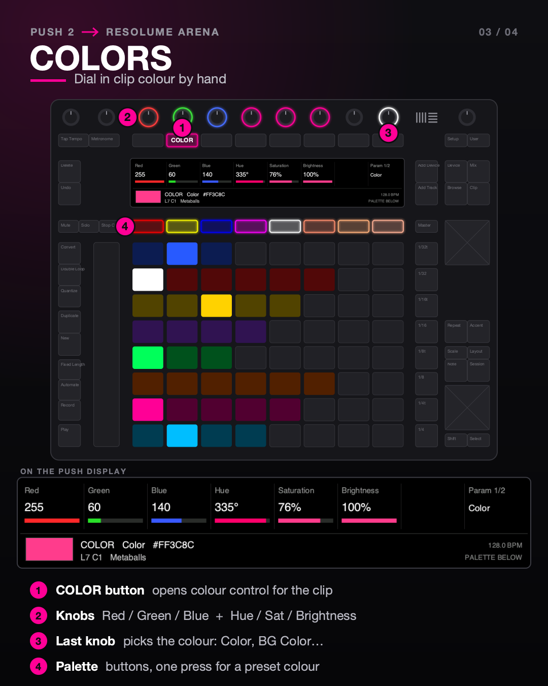
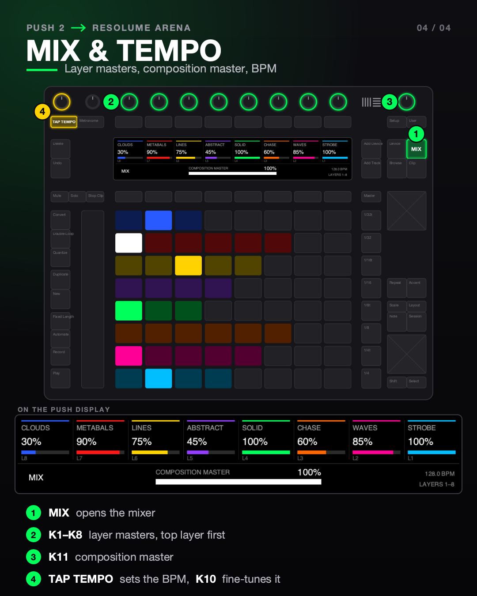
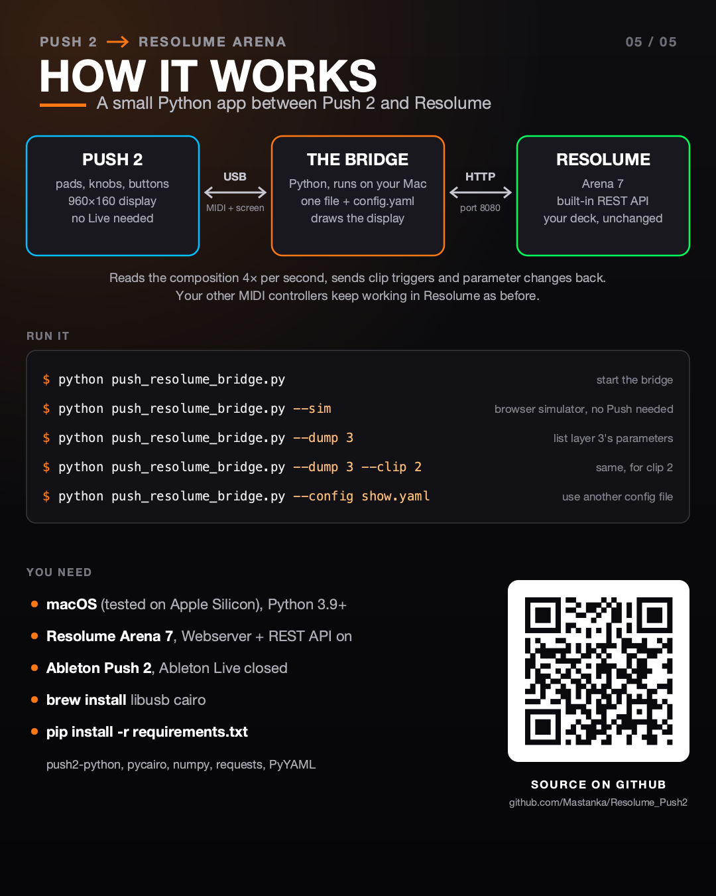

# Push 2 → Resolume Arena

Use an **Ableton Push 2** as a hands-on controller for **Resolume Arena**.
Launch clips from the pads, change clip and effect parameters with the knobs, dial in colours, mix
layers and tap the tempo, all with a custom interface on the Push's own display.

It was built for live concert lighting (Resolume pixel-mapping LED bars behind a band), but
it works with any Resolume deck.

<p>
  
  
  
  
</p>

## What it does

- **Clips:** your Resolume deck appears on the 8×8 pads, one colour per layer (dim = loaded,
  bright = playing, pulsing on the beat). Tap a pad to select a clip, hold **Play** + pad to launch it,
  hold **Record** + pad to stop the layer, hold **Play** + a button below the display to launch a whole column.
- **Live controls:** **Stop Clip** is a blackout button, the buttons right of the pads **flash** their
  layer to full while held, **Mute** / **Solo** + pad mute or solo a layer.
- **Parameters:** the selected clip's parameters (generator, effects, transport) show on the display
  with live values. Turn them with the 8 knobs, flip pages with the buttons below the display, and
  move the parameters you use most onto page 1.
- **Colors:** red / green / blue and hue / saturation / brightness knobs for the clip's colours, your own
  palette on the buttons below the display, a **master colour** for the whole show, and paste a colour
  to many clips at once.
- **FX:** switch the clip's and the layer's effects on and off, with their amount on the knobs.
- **Mix:** one knob per layer master, plus the composition master; mute and solo per layer. Mix, Mute
  and Solo open their screen on a click, or only while held.
- **Tempo:** Tap Tempo (Resolume's own tap), resync, a BPM knob, and a beat indicator.
- **Step sequencer:** a drum-rack style chaser for LED bars. Up to 4 textures flash across the bars in
  16-pattern step sequences with ADSR envelopes, edited on the pads like Push's own drum sequencer. The
  flashing itself is done by the **Bar Chaser** effect (included, `plugin/`) on your own layers.

It talks to Resolume through Resolume's own REST API and WebSocket (live updates), so there is nothing to install in Resolume and
your deck stays unchanged. Other MIDI controllers mapped in Resolume keep working alongside it.



## Quick start

For people who already have Homebrew and Python:

```bash
brew install libusb cairo pkg-config git
git clone https://github.com/Mastanka/Resolume_Push2.git && cd Resolume_Push2
python3 -m venv .venv && source .venv/bin/activate
pip install -r requirements.txt
python push_resolume_bridge.py
```

Before you run it: in Resolume, **Preferences → Webserver → Enable Webserver & REST API**
(port 8080).

## Detailed installation (macOS)

Tested on macOS (Apple Silicon) with Resolume Arena 7.23. macOS only for now: the Push display
library path, the Bar Chaser build and the Advanced Output preset folder are macOS-specific.

**1. Turn on Resolume's web API**
Resolume Arena → **Preferences → Webserver** → tick **Enable Webserver & REST API**. Leave the
port at **8080**.

**2. Install Homebrew** (skip if `brew --version` already works). Open **Terminal** and paste
the install command from [brew.sh](https://brew.sh).

**3. Install the system libraries**
```bash
brew install libusb cairo pkg-config git
```
`libusb` lets the bridge draw on the Push display, and `cairo` draws the interface.

**4. Download this project**
```bash
cd ~/Documents
git clone https://github.com/Mastanka/Resolume_Push2.git
cd Resolume_Push2
```
(Or use **Code → Download ZIP** on GitHub, unzip it, and `cd` into the folder.)

**5. Create a Python environment and install the packages**
```bash
python3 -m venv .venv
source .venv/bin/activate
pip install -r requirements.txt
```
Python 3.9 or newer is fine; macOS's built-in `python3` works. This installs push2-python,
pycairo, numpy, requests and PyYAML into the project folder only.

**6. Connect the Push**
Plug in the Push 2 with its power supply (the display needs it), and make sure **Ableton Live is
closed**, because Live takes over the Push.

**7. Run it**
```bash
source .venv/bin/activate      # each time you open a new Terminal window
python push_resolume_bridge.py
```
The Push display shows your deck. Press **Ctrl+C** to quit.

### Troubleshooting

| Problem | Fix |
|---|---|
| Display says *Waiting for Resolume* | Check step 1, and that Resolume is running on the same Mac (or set `host` in `config.yaml`). |
| *Push 2 MIDI port not found* | The Push is off or unplugged, or Ableton Live is still running. |
| Pads work, display stays black | The Push isn't on its power supply, or libusb is missing (`brew install libusb`). |
| `pip install` fails on pycairo | `brew install cairo pkg-config`, then run `pip install` again. |

## Controls

**Clips and live**

| Control | Does |
|---|---|
| **Pads** | Select a clip (it opens in Resolume's clip panel too) |
| **Play** + pad | Launch the clip |
| **Play** + button below the display | Launch the whole column above that button |
| **Record** + pad | Stop that layer |
| Hold **Mute** / **Solo** + pad | Mute / solo that pad's layer (muted layers turn grey) |
| **Buttons right of the pads** | Flash: hold = that row's layer at 100 %, release = back |
| **Stop Clip** | Blackout: composition master to 0, press again to restore (blinks red, banner on the display) |
| ▲ ▼ ◀ ▶ | Scroll layers / columns (Shift = jump 8) |

**Two views.** **Session** = the pads show clips (CLIP view). **Note** = the pads show the step
sequencer (SEQUENCER view). Each view has its own menus on the buttons above the display (white in
CLIP, red in SEQUENCER) and remembers the last one you used.

**CLIP view menus**

| Button above the display | 8 knobs | Buttons below the display |
|---|---|---|
| **1 CLIP PARAMS** | The clip's parameters (source, clip effects, speed). **Convert** + touch a knob = move a parameter: change page, touch the target knob, the two swap | Page 1–8 |
| **2 CLIP COLOR** | Red, Green, Blue, Hue, Saturation, Brightness; last knob = which colour | Your palette. **Shift** + button = save the current colour there. Hold **Duplicate** + pad / button right of a row / button below = paste the colour to that clip / layer / column |
| **3 CLIP EFFECTS** | The clip's effects: amount | Effect on / off (Page < > for more effects) |
| **6 LAYER PARAMS** | The layer's opacity and its effects' parameters (Convert works here too) | Page 1–8 |
| **7 LAYER EFFECTS** | The layer's effects: amount | Effect on / off |
| **Master** button | COLOR for the whole show (the composition's Colorize effect); 7th knob = amount, 8th = on / off | Your palette |

**MIX, MUTE, SOLO** (Mix, Mute and Solo buttons) work in both views. **Click** = the screen opens and
stays; click the same button again = back to the previous screen. **Hold** = the screen shows while you
hold the button and goes back when you let go.

| Screen | 8 knobs | Buttons below the display |
|---|---|---|
| **MIX** | Layer masters, top layer first (Master knob = composition master) | Mute; hold **Solo** = solo |
| **MUTE** | Layer masters | Mute (red = muted) |
| **SOLO** | Layer masters | Solo (yellow = soloed) |

**Knobs and tempo**

| Control | Does |
|---|---|
| **Shift** + knob | Fine steps |
| **Master knob** (far right) | Selected layer's opacity, or the composition master in MIX |
| **Tap Tempo** | Resolume's tap tempo. **Shift** + Tap Tempo = resync (beat 1 = now). Flashes on the beat |
| **Tempo knob** (far left) | BPM ±1, Shift ±0.1 |
| **Metronome** | Pads pulse on the beat on / off |

**Step sequencer (SEQUENCER view)** — press **Note**; **Session** goes back to the clips.
Menus (red): **1 ENVELOPE** = knobs Attack, Decay, Sustain, Release, Gate. **2 SETTINGS** = knobs
Direction, Length, Level. **3 PRESETS** = ready-made patterns (the Techno bank: 16 presets) that fit
your rig: the buttons below the display are the presets (Shift = 9–16). Press one (it blinks, and so
does the pattern row), then a pattern pad: an empty slot gets the preset, a used one asks
*Overwrite?* with button 7 = NO and 8 = YES. The preset places kicks on the long bars and hats on the
short ones of whatever rig is mapped (4–24 fixtures); if the rig changes, the bridge re-fits preset
patterns when a composition loads, and asks in PRESETS when it changes during the show.
**4 MAPPING** = which DMX fixture each pad lights, shared by all tracks: the top four pad rows show the
fixtures (L1F1, L1F2, L2F1 … = lumiverse / fixture, in Arena's order), row 5 is red, rows 6–8 are pads
1–24. Hold **Select** and press a fixture (it blinks), then press a pad to store it there (both blink
twice). **Delete** + pad = no fixture. **Octave** ▲ ▼ = more fixtures.

It needs the **Bar Chaser** effect (in `plugin/`, built with `plugin/build.sh`, installed with
`python push_resolume_bridge.py --install-plugin`, then restart Arena). Save your Advanced Output as a
preset once (Arena → Output → Advanced → Presets → Save): the effect reads it and lists every DMX
fixture ("Lumiverse 1 / 1 - 423 141 RGB"), then every whole lumiverse, in its **Pad 1 … Pad 24**
dropdowns. New pads start on fixture 1, 2, 3 … Put one Bar Chaser on each layer whose clip you want to flash,
as the **last** effect on the layer (or press **Shift + Note** with a clip of that layer selected),
and set its **Track** (1–4) — or hold **Browse** and press track button 1–4 on the Push.

```
rows 1–4   32 steps of the selected track on the selected pads (green = playhead)
row 5      patterns 1–8 (Shift = 9–16)
rows 6–8   pads 1–24, bottom-left = pad 1, each = a slice chosen in the effect
```

| Control | Does |
|---|---|
| Pad | Select only that pad and flash it |
| **Select** (dim in SEQ) | Tap = multi-select on (lit) / off; then each pad adds to / removes from the selection. Hold + pads works too |
| Tap a step | On / off for every selected pad; tap harder for a brighter flash (**Accent** = always full) |
| Hold a step + Gate knob (ENVELOPE) / Level knob (SETTINGS) | That step's gate / level on the selected pads |
| **Repeat** on + hold a pad | Strobe at the grid rate |
| Buttons below the display 1–4 | Select the texture track; **Browse** + button = the selected clip's layer joins that track |
| Pattern pad (row 5) | Switch at the next bar; press it again to switch now |
| **Play** | Run / stop |
| **Layout** → buttons right of the pads | Pad groups 1–8. **Select** + button = store the selection for this track; **Select** + **Shift** + button = store it for all tracks (global). Tap = select that group's pads. **Delete** (+ **Shift**) + button = clear. Track group = track colour, global group = white; dim = stored, bright = current, off = empty. A track's own group hides the global one on that button |
| **Scale** → buttons right of the pads | Grid 1/4 … 1/32t (white = current) |
| **Delete** + step / pad / track / pattern / group | Clear |
| **Duplicate** + pattern → pattern | Copy |
| **Double Loop** / **Fixed Length** + button 1–8 | Double the pattern / length 4–32 |
| Knobs | See ENVELOPE / SETTINGS above; Swing encoder = swing |

**Isolation:** a group only selects pads. Steps belong to the track you made them on, so a global
group used on track 2 only flashes track 2's layers.

**One pad mapping for all tracks:** every Bar Chaser uses the same **Pad 1–24** settings, remembered in
`chases.yaml`. Change a pad in Arena on any layer and all layers follow; a new Bar Chaser gets the
mapping within a few seconds. Opening a composition takes T1's mapping and gives it to the others.

**In the effect's panel:** Preset (empty = newest), Reload, Track, Master, Edge (soft edges), Outside
(transparent / black / pass through), Mode (Texture / Solid white / Show pads = numbered rectangles for
setup), Pad 1–24 (which slice), Level 1–24 (the live levels, also a manual test).

## Configuration

Everything is in [`config.yaml`](config.yaml): Resolume address, knob step sizes, and optionally
your own list of parameters per layer. To see which parameters a layer has:

```bash
python push_resolume_bridge.py --dump 3            # layer 3
python push_resolume_bridge.py --dump 3 --clip 2   # layer 3, clip 2
```

The parameter order you set with **Convert** is saved in `pins.yaml`, your own colours in
`colors.yaml`, sequencer patterns in `chases.yaml`. Delete any of them to go back to the defaults.

| Command line | |
|---|---|
| `python push_resolume_bridge.py` | Run the bridge |
| `--sim` | Browser simulator of the Push at http://localhost:6128, no hardware needed |
| `--dump LAYER [--clip COLUMN]` | List parameter paths for `config.yaml` |
| `--config FILE` | Use a different config file |
| `--check LAYER` | Test every Resolume command on a spare layer (each change is undone) and print OK / FAIL. Add `--check-columns` to also launch a column |
| `--install-plugin [BUNDLE]` | Copy the built Bar Chaser effect into Resolume's Extra Effects folder (then restart Arena) |

## Ideas and feedback welcome

Got an idea for a new feature, a workflow that would help your show, or found something that
doesn't work with your Resolume setup? **[Open an issue](https://github.com/Mastanka/Resolume_Push2/issues/new/choose)** and tell me about it.
Every suggestion is read. Some things already on the list:

- Clip thumbnails on the display and Resolume's clip colours on the pads
- Touch strip for the crossfader
- Pad pressure for intensity
- Deck switching

## License

[MIT](LICENSE). Free to use, change and share.
